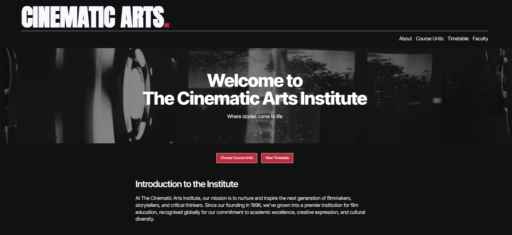

# The Cinematic Arts Institute 🎬

## Overview

Cinematic Arts Institute is an interactive platform designed for film students to explore courses and create personalised timetables. It offers a user-friendly experience, allowing students to select modules based on their preferences and automatically generates a timetable to fit their choices.

## Screenshot

  

## Link to deployed site

[https://cinematic-arts.vercel.app/](https://cinematic-arts.vercel.app/)

## Technologies Used

- 
- 
- 
- 